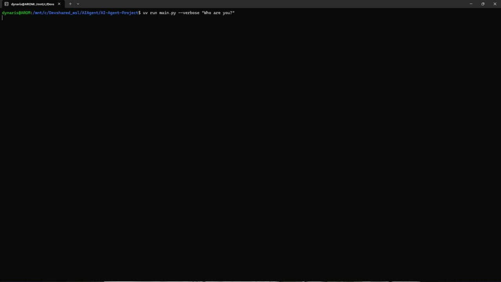

# Ollama API AI Agent

This is a Python-based Ollama API Agent that besides the normal functions of an AI, can read, write, check the contents and the properties of files via function calls.

## Disclaimer

- This software is provided for personal and educational use only. The author assumes no responsibility or liability for any loss or damage resulting from the use of the information provided by this tool.

- If you have any doubts about a technical troubleshooting, ensure you take the appropriate caution and see your local technician.

- Issues and pull requests may not be reviewed promptly, as this is a fun project of mine.

- Performance heavily relies on your machine's hardware and the model selected (the more parameters, the slower it will be reasoning).

## Demo



Full video [here](https://github.com/user-attachments/assets/7f56d7fd-9394-4b9e-a5a0-dc704b46269e) or in `video_demo` directory.


## Installation

Download your preferred Ollama model:

1. Follow the installation instructions for Ollama [by clicking here](https://ollama.com/download);
2. Download preferred model: 

    - If using **Linux**:
    ```bash
    ollama pull [full model name]
    ```
    - Example:
    ```bash
    ollama pull qwen2.5:14b
    ```
    - If using **Windows**, follow the installation path provided by the executable.

3. Open `src/LLM/config.py` and configure `OLLAMA_MODEL`.

4. Clone the repository:
    
    ```bash
    git clone https://github.com/Dynaris/Logform-Interp.git
    cd logform-interp
    ```

5. Create a virtual environment:

    ```bash
    python3 -m venv .venv
    ```

6. Activate the environment:
    - Linux/macOS:
        ```bash
        source .venv/bin/activate
        ```

    - Windows:
        ```bash
        .venv\Scripts\activate
        ```

7. Install dependencies:
    ```bash
    pip install -r requirements.txt
    ```
    
## Usage/Examples

```bash
python main.py "Who are you?"
```

or if you use UV:

```bash
uv run main.py "Who are you?"
```

You can also use `--verbose` to track token usage, for example:

```bash
uv run main.py --verbose "Who are you?"
```
(`--verbose` can be used both before or after the prompt)


## Features
- Local LLM integration through Ollama API
- Tool-calling and function execution
- File and directory inspection
- File creation and modification
- Python script execution
- Automated tool selection based on user's requests
- Configurable system prompt
- Modular tool architecture for expansion
- No cloud dependency


## Tech Stack
- Python
- Ollama API


## Contributing

Given the current project status and end goal, no contributions are being accepted at the moment.


## License

See the [LICENSE](./LICENSE) file for full details.